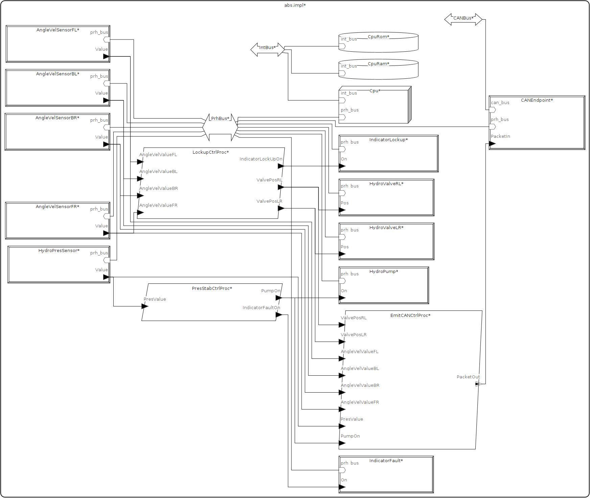

# AADL-car-ABS

#### Szymon Miekina - smiekina@student.agh.edu.pl

System czasu rzeczywistego modelujący system ABS w samochodzie.

## Opis systemu

### Interakcje w systemie

Mikroprocesor komunikuje się z pamięciami RAM i ROM poprzez wewnętrzną magistrale,
która sluży wyłącznie do celów oprogramowania układu, reszta urządzeń jest podłączona
do magistrali zewnętrznej tj. sensory i aktuatory.

Każde urządzenie ma własny wątek, wątki natomiast są pogrupowane wg typu urządzenia -
np. czujniki prędkości obrotowej obsługuje jeden proces. System zawiera zatem proces
zbierania danych predkości obrotowej, obsługi elektrozaworów, obsługi pompy,
sprawdzenia ciśnienia układu, kontrolek inforumujących o stanie systemu.

W trakcie pracy i czuwania systemu co 20ms wysylane jest na magistrale CAN
pakiety: stanu blokady kol (prekosc i pozycje zaworow), stanu ukladu hydraulicznego
(cisnienie i stan zalaczenia pompy).

### Zachowanie systemu

Oprócz danych o prędkości obrotowej kół, istnieje szereg innych czynników wpływajacy
na parametry systemu - jednym z nich jest sam kierowca, który zmienia ciśnienie w
układzie hamulcowym za pomocą pedału hamulca. Ciśnienie ulega gwałtownym zmianom
w czasie działania elektrozaworów, które maja kilka razy na sekundę zmieniają swoje
położenia na:
1. stan otwarcia, ciśnienie w cylindrze jest wyrównane z resztą systemu
2. stan zamknięcia, ciśnienie w cylindrze hamulcowym pozostaje stałe
3. stan redukcji, ciśnienie w cylindrze ulega częsciowemu obniżeniu

Ciśnienie w układzie hamucowym jest bardzo dynamiczne w przypadku aktywacji systemu.
W celu stabilizacji ciśnienia w głównym układzie hamulcowym podczas pracy 
elektrozaworów, uruchamiana jest pompa doładowująca układ płynem hamulcowym upuszczonym
z cylindrów układu hamulcowego. Pompa jest modulowana w taki sposób aby ciśnienie
utrzymywało się na zadanym przez kontroler poziomie.

Wykrywanie wczesnych objawów poślizgu kół polega na porównywaniu prędkości kół i
detekcji nadmiernych wartości deakceleracji obrotowej kół. W tym wariancie systemu
w przypadku wykrycia poślizgu następuje redukcja ciśnienia w hamulcach położonych
na przeciwległych końcach pojazdu, tj. przednie prawe koło i tylnie lewe koło i 
vice versa. 

Kontrolki stanu systemu informują kierowce o zadziałaniu systemu i ew. uszkodzeniu układu
ABS lub/i hamulcowego.

## Opis dla kierowcy

Kierowca ma posredni lecz realny wplyw na stan systemu korzystajac z hamulca i potencjalnie
powodujac poslizg kol. W trakcie dzialania systemu, miga pomaranczowa kontrolka ABS,
w wypadku zbyt niskiego cisnienia w ukladzie swieci sie kontrolka hamulcow.

## Podstawowe komponenty

- *(processor, memory)* mikroprocesor z pamięcią RAM i ROM
- *(bus)* magistrale: wewn. (Int) i zewn. (Prh), CAN
- *(device)* 4 czujniki prędkości obrotowej dla każdego koła
- *(device)* 2 elektrozawory obu obwodów
- *(device)* pompa stabilizująca ciśnienie w układzie hamulcowym
- *(device)* czujnik ciśnienia układu hamulcowego
- *(device)* kontrolka informująca kierowce o aktywacji systemu
- *(device)* kontrolka informująca o awarii systemu ABS / układu hamowania
- *(device)* transmitter/receiver pakietow CAN
- *(process & 1 thread)* kontroler predkosci kol i poslizgu
- *(process & 1 thread)* kontroler stabilizacji cisnienia
- *(process & 2 threads)* emiter stanu systemu (blokowania kol, cisnienia systemu hamowania)

## Schemat systemu



## Analiza systemu

### Not Bound Resources Budget

```csv
Resource Summary: 
  MIPS capacity 1.200 MIPS : MIPS budget 1.000 MIPS
  1 out of 1 with MIPS capacity
  3 out of 3 with MIPS budget


Detailed Processor MIPS Capacity Report 

Component,Capacity
processor Cpu, 1.200 MIPS,
Total, 1.200 MIPS,


Detailed MIPS Budget Report 

Component,Budget,Actual,Notes
device HydroValveLR, 0.000 MIPS,0.000 MIPS,
device HydroValveRL, 0.000 MIPS,0.000 MIPS,
device HydroPump, 0.000 MIPS,0.000 MIPS,
device HydroPresSensor, 0.000 MIPS,0.000 MIPS,
device AngleVelSensorFL, 0.000 MIPS,0.000 MIPS,
device AngleVelSensorFR, 0.000 MIPS,0.000 MIPS,
device AngleVelSensorBL, 0.000 MIPS,0.000 MIPS,
device AngleVelSensorBR, 0.000 MIPS,0.000 MIPS,
device IndicatorLockup, 0.000 MIPS,0.000 MIPS,
device IndicatorFault, 0.000 MIPS,0.000 MIPS,
device CANEndpoint, 0.000 MIPS,0.000 MIPS,
process LockupCtrlProc, 0.700 MIPS,0.000 MIPS,process abs_impl_Instance.LockupCtrlProc total 0.000 MIPS below budget 0.700 MIPS (100.0 % slack)
process PresStabCtrlProc, 0.200 MIPS,0.000 MIPS,process abs_impl_Instance.PresStabCtrlProc total 0.000 MIPS below budget 0.200 MIPS (100.0 % slack)
process EmitCANCtrlProc, 0.100 MIPS,0.000 MIPS,process abs_impl_Instance.EmitCANCtrlProc total 0.000 MIPS below budget 0.100 MIPS (100.0 % slack)
Total, ,1.000 MIPS,

```

### Bound Resources Capacity

```csv
Processor Summary Report: 
  Processor Cpu: Total MIPS 1.000 MIPS of bound tasks within MIPS capacity 1.200 MIPS of Cpu

Memory Summary Report: 
  No Memory with Memory_Size or RAMCapacity or ROMCapacity


Detailed Workload Report:  for Processor Cpu with Capacity 1.200 MIPS

Component,Budget,Actual
process LockupCtrlProc, 0.700 MIPS,0.000 MIPS,process abs_impl_Instance.LockupCtrlProc total 0.000 MIPS below budget 0.700 MIPS (100.0 % slack)
process PresStabCtrlProc, 0.200 MIPS,0.000 MIPS,process abs_impl_Instance.PresStabCtrlProc total 0.000 MIPS below budget 0.200 MIPS (100.0 % slack)
process EmitCANCtrlProc, 0.100 MIPS,0.000 MIPS,process abs_impl_Instance.EmitCANCtrlProc total 0.000 MIPS below budget 0.100 MIPS (100.0 % slack)
Total,,1.000 MIPS

```

### Weight Totals

```csv
Weight totals Report

Warning! IntBus: [L] No net weight plus subcomponent weight or no gross weight
Warning! PrhBus: [L] No net weight plus subcomponent weight or no gross weight
Warning! CANBus: [L] No net weight plus subcomponent weight or no gross weight
HydroValveLR: [L] Sum of weights / gross weight is 1.600 kg (no limit specified)
HydroValveRL: [L] Sum of weights / gross weight is 1.600 kg (no limit specified)
HydroPump: [L] Sum of weights / gross weight is 2.400 kg (no limit specified)
HydroPresSensor: [L] Sum of weights / gross weight is 0.600 kg (no limit specified)
AngleVelSensorFL: [L] Sum of weights / gross weight is 0.400 kg (no limit specified)
AngleVelSensorFR: [L] Sum of weights / gross weight is 0.400 kg (no limit specified)
AngleVelSensorBL: [L] Sum of weights / gross weight is 0.400 kg (no limit specified)
AngleVelSensorBR: [L] Sum of weights / gross weight is 0.400 kg (no limit specified)
IndicatorLockup: [L] Sum of weights / gross weight is 0.100 kg (no limit specified)
IndicatorFault: [L] Sum of weights / gross weight is 0.100 kg (no limit specified)
CANEndpoint: [L] Sum of weights / gross weight is 0.400 kg (no limit specified)
Warning! CpuRam: [L] No net weight plus subcomponent weight or no gross weight
Warning! CpuRom: [L] No net weight plus subcomponent weight or no gross weight
Warning! Cpu: [L] No net weight plus subcomponent weight or no gross weight
abs_impl_Instance: [A] Sum of weights (8.400 kg) is below weight limit of 10.000 kg (16.0 % Weight slack)
```

### Bus Load

```csv
Bus load analysis of abs_impl_Instance


"Physical Bus","Capacity (KB/s)","Budget (KB/s)","Required Budget (KB/s)","Actual (KB/s)"
"IntBus","2000.0","200.0","0.0","0.0"
"PrhBus","1000.0","100.0","0.0","2.0"
"CANBus","600.0","40.0","0.0","2.0"

"Bus IntBus has data overhead of 0 bytes"
"Bound Virtual Bus/Connection","Capacity (KB/s)","Budget (KB/s)","Required Budget (KB/s)","Actual (KB/s)"

"Bus PrhBus has data overhead of 0 bytes"
"Bound Virtual Bus/Connection","Capacity (KB/s)","Budget (KB/s)","Required Budget (KB/s)","Actual (KB/s)"
"HydroPresSensor.Value -> PresStabCtrlProc.PresValue","","0.0","","0.4"
"AngleVelSensorFL.Value -> LockupCtrlProc.AngleVelValueFL","","0.0","","0.4"
"AngleVelSensorFR.Value -> LockupCtrlProc.AngleVelValueFR","","0.0","","0.4"
"AngleVelSensorBL.Value -> LockupCtrlProc.AngleVelValueBL","","0.0","","0.4"
"AngleVelSensorBR.Value -> LockupCtrlProc.AngleVelValueBR","","0.0","","0.4"
"LockupCtrlProc.ValvePosLR -> HydroValveLR.Pos","","0.0","","0.0"
"LockupCtrlProc.ValvePosRL -> HydroValveRL.Pos","","0.0","","0.0"
"LockupCtrlProc.IndicatorLockUpOn -> IndicatorLockup.On","","0.0","","0.0"
"PresStabCtrlProc.PumpOn -> HydroPump.On","","0.0","","0.0"
"PresStabCtrlProc.IndicatorFaultOn -> IndicatorFault.On","","0.0","","0.0"

"Connection HydroPresSensor.Value -> PresStabCtrlProc.PresValue bound to PrhBus"
"WARNING: Connection HydroPresSensor.Value -> PresStabCtrlProc.PresValue has no bandwidth budget"

"Connection AngleVelSensorFL.Value -> LockupCtrlProc.AngleVelValueFL bound to PrhBus"
"WARNING: Connection AngleVelSensorFL.Value -> LockupCtrlProc.AngleVelValueFL has no bandwidth budget"

"Connection AngleVelSensorFR.Value -> LockupCtrlProc.AngleVelValueFR bound to PrhBus"
"WARNING: Connection AngleVelSensorFR.Value -> LockupCtrlProc.AngleVelValueFR has no bandwidth budget"

"Connection AngleVelSensorBL.Value -> LockupCtrlProc.AngleVelValueBL bound to PrhBus"
"WARNING: Connection AngleVelSensorBL.Value -> LockupCtrlProc.AngleVelValueBL has no bandwidth budget"

"Connection AngleVelSensorBR.Value -> LockupCtrlProc.AngleVelValueBR bound to PrhBus"
"WARNING: Connection AngleVelSensorBR.Value -> LockupCtrlProc.AngleVelValueBR has no bandwidth budget"

"Connection LockupCtrlProc.ValvePosLR -> HydroValveLR.Pos bound to PrhBus"
"WARNING: Connection LockupCtrlProc.ValvePosLR -> HydroValveLR.Pos has no bandwidth budget"

"Connection LockupCtrlProc.ValvePosRL -> HydroValveRL.Pos bound to PrhBus"
"WARNING: Connection LockupCtrlProc.ValvePosRL -> HydroValveRL.Pos has no bandwidth budget"

"Connection LockupCtrlProc.IndicatorLockUpOn -> IndicatorLockup.On bound to PrhBus"
"WARNING: Connection LockupCtrlProc.IndicatorLockUpOn -> IndicatorLockup.On has no bandwidth budget"

"Connection PresStabCtrlProc.PumpOn -> HydroPump.On bound to PrhBus"
"WARNING: Connection PresStabCtrlProc.PumpOn -> HydroPump.On has no bandwidth budget"

"Connection PresStabCtrlProc.IndicatorFaultOn -> IndicatorFault.On bound to PrhBus"
"WARNING: Connection PresStabCtrlProc.IndicatorFaultOn -> IndicatorFault.On has no bandwidth budget"

"Bus CANBus has data overhead of 0 bytes"
"Bound Virtual Bus/Connection","Capacity (KB/s)","Budget (KB/s)","Required Budget (KB/s)","Actual (KB/s)"
"HydroPresSensor.Value -> EmitCANCtrlProc.PresValue","","0.0","","0.4"
"AngleVelSensorFL.Value -> EmitCANCtrlProc.AngleVelValueFL","","0.0","","0.4"
"AngleVelSensorFR.Value -> EmitCANCtrlProc.AngleVelValueFR","","0.0","","0.4"
"AngleVelSensorBL.Value -> EmitCANCtrlProc.AngleVelValueBL","","0.0","","0.4"
"AngleVelSensorBR.Value -> EmitCANCtrlProc.AngleVelValueBR","","0.0","","0.4"
"LockupCtrlProc.ValvePosLR -> EmitCANCtrlProc.ValvePosLR","","0.0","","0.0"
"LockupCtrlProc.ValvePosRL -> EmitCANCtrlProc.ValvePosRL","","0.0","","0.0"
"PresStabCtrlProc.PumpOn -> EmitCANCtrlProc.PumpOn","","0.0","","0.0"
"EmitCANCtrlProc.PacketOut -> CANEndpoint.PacketIn","","0.0","","0.0"

"Connection HydroPresSensor.Value -> EmitCANCtrlProc.PresValue bound to CANBus"
"WARNING: Connection HydroPresSensor.Value -> EmitCANCtrlProc.PresValue has no bandwidth budget"

"Connection AngleVelSensorFL.Value -> EmitCANCtrlProc.AngleVelValueFL bound to CANBus"
"WARNING: Connection AngleVelSensorFL.Value -> EmitCANCtrlProc.AngleVelValueFL has no bandwidth budget"

"Connection AngleVelSensorFR.Value -> EmitCANCtrlProc.AngleVelValueFR bound to CANBus"
"WARNING: Connection AngleVelSensorFR.Value -> EmitCANCtrlProc.AngleVelValueFR has no bandwidth budget"

"Connection AngleVelSensorBL.Value -> EmitCANCtrlProc.AngleVelValueBL bound to CANBus"
"WARNING: Connection AngleVelSensorBL.Value -> EmitCANCtrlProc.AngleVelValueBL has no bandwidth budget"

"Connection AngleVelSensorBR.Value -> EmitCANCtrlProc.AngleVelValueBR bound to CANBus"
"WARNING: Connection AngleVelSensorBR.Value -> EmitCANCtrlProc.AngleVelValueBR has no bandwidth budget"

"Connection LockupCtrlProc.ValvePosLR -> EmitCANCtrlProc.ValvePosLR bound to CANBus"
"WARNING: Connection LockupCtrlProc.ValvePosLR -> EmitCANCtrlProc.ValvePosLR has no bandwidth budget"

"Connection LockupCtrlProc.ValvePosRL -> EmitCANCtrlProc.ValvePosRL bound to CANBus"
"WARNING: Connection LockupCtrlProc.ValvePosRL -> EmitCANCtrlProc.ValvePosRL has no bandwidth budget"

"Connection PresStabCtrlProc.PumpOn -> EmitCANCtrlProc.PumpOn bound to CANBus"
"WARNING: Connection PresStabCtrlProc.PumpOn -> EmitCANCtrlProc.PumpOn has no bandwidth budget"

"Connection EmitCANCtrlProc.PacketOut -> CANEndpoint.PacketIn bound to CANBus"
"WARNING: Connection EmitCANCtrlProc.PacketOut -> CANEndpoint.PacketIn has no bandwidth budget"
```
